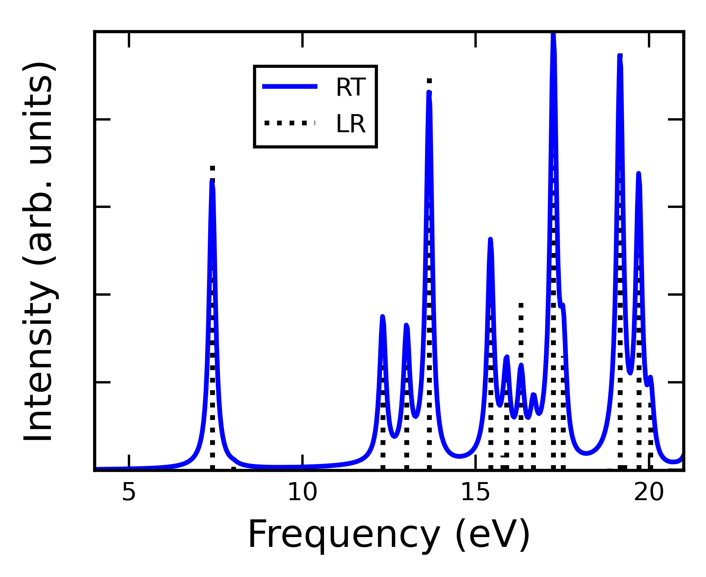
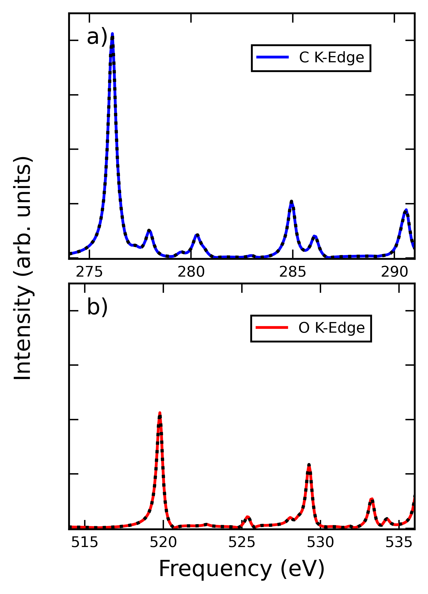
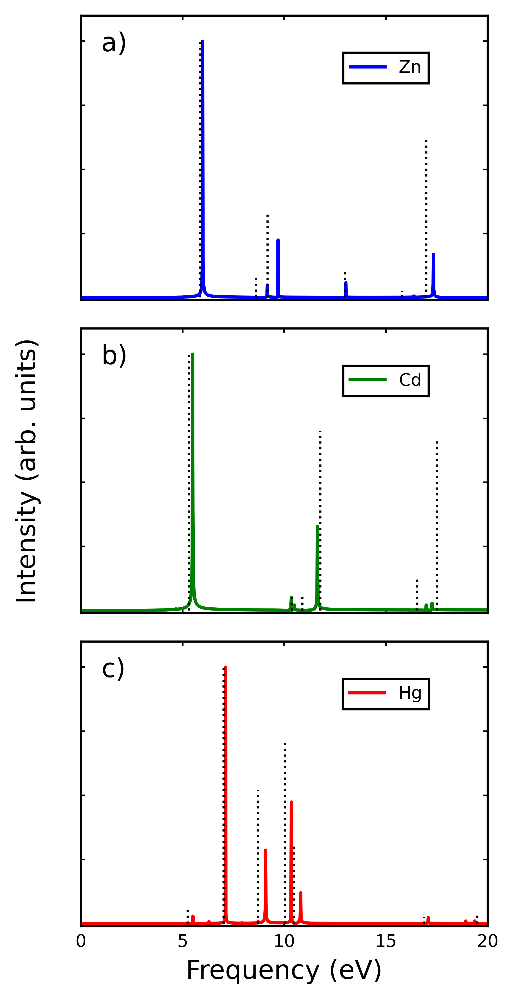
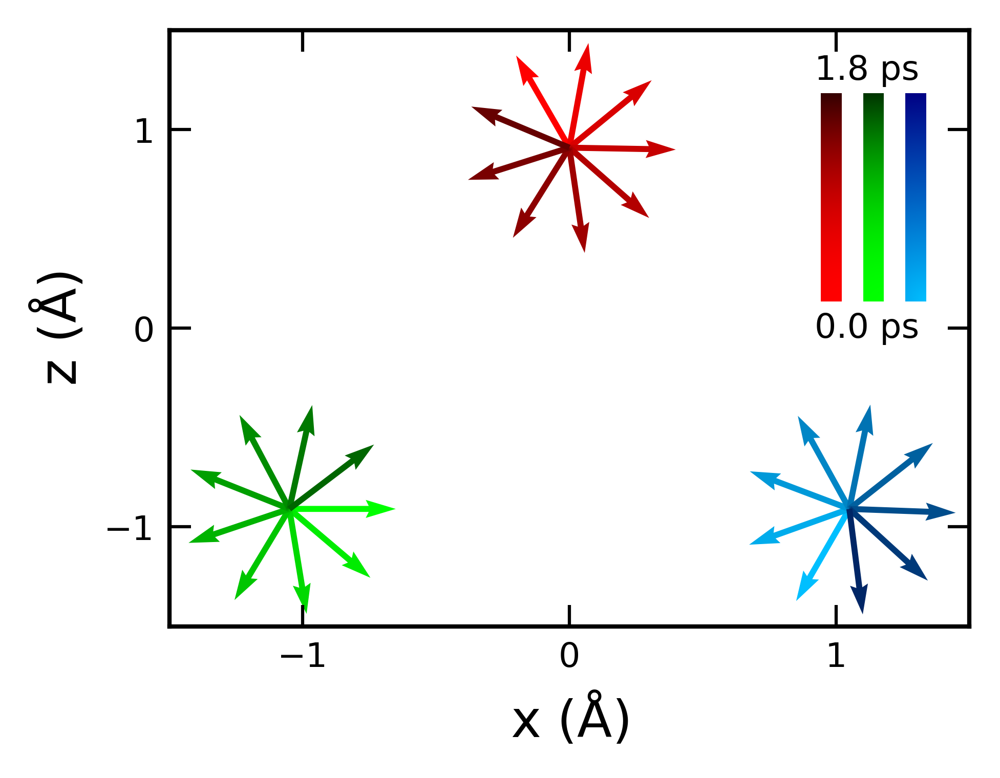
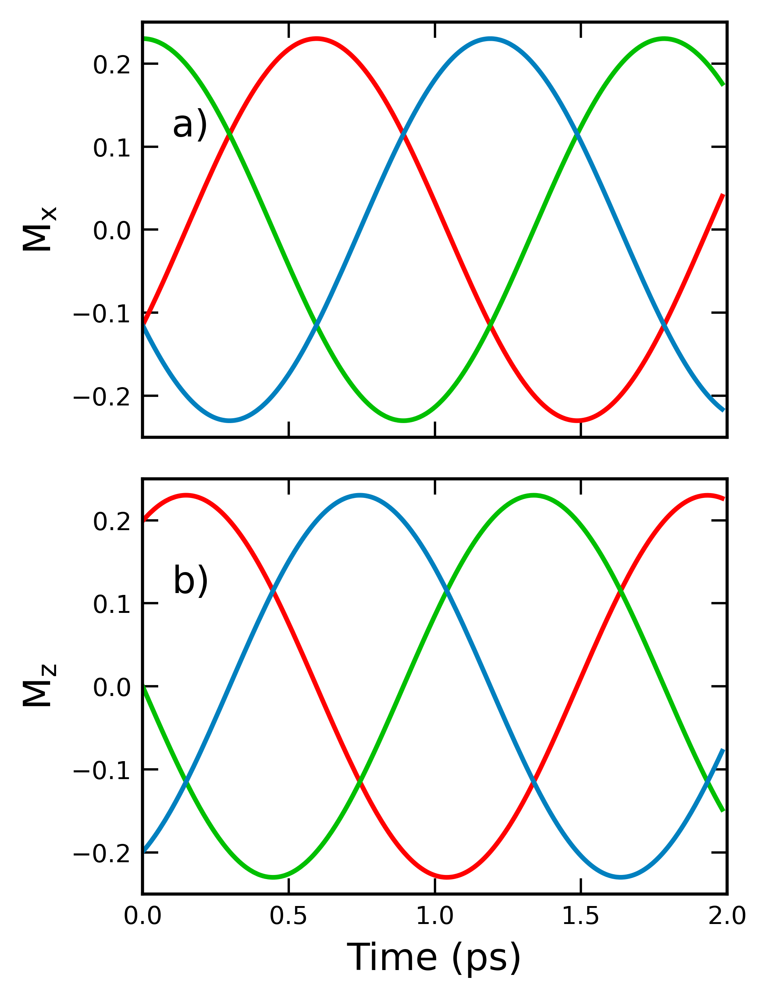
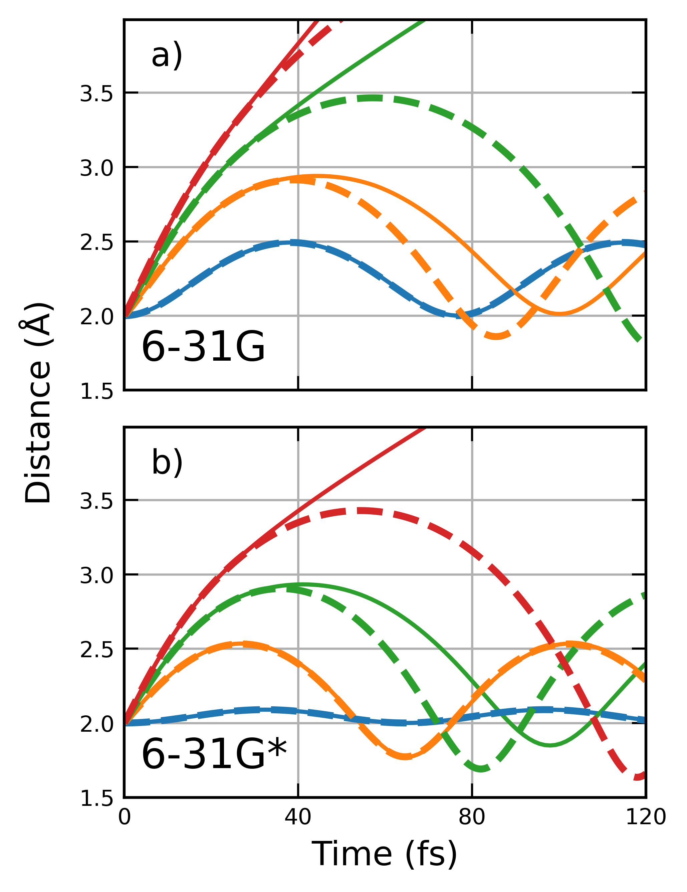

# Examples

Every example in the
[`examples/`](https://github.com/oholtfrank3/TIDES/tree/docs/examples) directory
is a runnable script. Most ship a matching `Workup_*.py` that parses the output
and produces the figures shown here.

[`examples/Example_Workbook.ipynb`](https://github.com/oholtfrank3/TIDES/blob/docs/examples/Example_Workbook.ipynb)
is a good interactive starting point.

## Start here

| Example | What it shows |
|---|---|
| `Water_RHF_UV-Vis/` | The canonical first calculation: delta kick → dipole → spectrum |
| `Water_RKS_UV-Vis/` | The same with DFT |
| `H2_Ehrenfest/` | Simplest coupled electron–nuclear dynamics |
| `Li_ChargeTransfer/` | Two-fragment charge transfer via NOSCF |

## From the TiDES paper

`examples/ExamplesFromOriginalTiDESPaper/` contains the inputs that generated
every figure in the publication.

### UV-Vis spectroscopy

{ width="420" }

Benzene at B3LYP/6-31G*, RT-TDDFT (solid blue) against LR-TDDFT in PySCF
(dashed black). → `UV-Vis/` · [guide](user-guide/spectroscopy.md#uv-vis)

### X-ray absorption

{ width="360" }

C and O K-edges of CO, TiDES (solid) against NWChem (dashed).
→ `XAS/` · [guide](user-guide/spectroscopy.md#x-ray-absorption)

### Spin–orbit coupling

{ width="280" }

Absorption spectra of Zn, Cd, and Hg including SOC via X2C1e, capturing the
spin-forbidden singlet–triplet transition in Hg.
→ `X2C1e/` · [guide](user-guide/relativistic.md#x2c1e)

### Charge migration

{ width="360" }

A hole migrating along a chain of four ethylenes after HOMO ionization,
initialized with the NOSCF routine.
→ `ChargeMigration/` · [guide](user-guide/fragments.md#worked-example-charge-migration)

### Intermolecular Coulombic decay

{ width="360" }

ICD in the water dimer after inner-valence ionization, with a CAP removing the
secondary electron. Fragment-basis MO occupations reveal the mechanism.
→ `ICD/` · [guide](user-guide/fragments.md#worked-example-icd)

### Spin dynamics

{ width="360" }

{ width="300" }

A spin-frustrated lithium trimer in a perpendicular magnetic field, simulated
with RT-GHF. Spins precess with a full period of ≈ 1.8 ps. Requires a
spin-generalized reference.
→ `SpinDynamics/` · [guide](user-guide/observables.md#magnetization)

### Ehrenfest dynamics

{ width="300" }

Cl₂ bond distance at several initial kinetic energies, Ehrenfest (solid) against
AIMD (dashed), for two basis sets.
→ `Ehrenfest/` · [guide](user-guide/ehrenfest.md)

## By feature

### Spectroscopy and fields

| Example | Notes |
|---|---|
| `Water_RHF_UV-Vis/` | RHF absorption spectrum, after the NWChem tutorial |
| `Water_RKS_UV-Vis/` | RKS absorption spectrum |
| `Water_GKSX2C1e_UV-Vis/` | Relativistic X2C1e spectrum |
| `Water_ResonantExcitation/` | Driving a single transition with a resonant field |
| `Water_MOCAP/` | Complex absorbing potential, with a matched no-CAP run |
| `H_BField/` | Magnetization dynamics of H in a static B-field (GHF) |

### Charge transfer

| Example | Notes |
|---|---|
| `Li_ChargeTransfer/` | Li₂⁺ charge transfer; compares Mulliken and Hirshfeld |
| `TCNE_ChargeTransfer/` | TCNE dimer, with `STO-3G/` and `Density_Fitted/` variants |

### Ehrenfest

| Example | Notes |
|---|---|
| `H2_Ehrenfest/` | H₂ with 10 eV of initial vibrational energy |
| `NaCl_Ehrenfest/` | A heteronuclear case |
| `H2_2c-Ehrenfest/` | BOMD vs Ehrenfest across RB3LYP, UB3LYP, and 2-component |

### Dispersion

| Example | Notes |
|---|---|
| `D3BJ_Dispersion/` | Grimme D3(BJ) dispersion correction |
| `VV10_Dispersion/` | VV10 non-local correlation |

### Customization

| Example | Notes |
|---|---|
| `Blank_Observable/` | Minimal custom observable template |
| `Custom_Observable/` | A filled-in custom observable |
| `Blank_Potential/` | Minimal custom potential template |
| `Custom_Potential/` | A filled-in custom potential |

### Practicalities

| Example | Notes |
|---|---|
| `Chkfile/` | Splitting a run across two jobs — `Part1/`, `Part2/`, `Workup/` |
| `Multithreading_SLURM/` | BLAS threading and a SLURM submission script |

### Relativistic

Under `src/examples/`:

| Example | Notes |
|---|---|
| `4C/` | 4-component DHF and DKS spectra of water |
| `pNA_polarizability/` | pNA polarizability, DHF-4C and HF-X2C |
| `zora/` | ZORA with generalized references — Ti-GHF, Ti-GKS, VF3-GHF |

!!! note "Figure credit"
    Figures on this page are from Rohan *et al.* (2026), reproduced under
    [CC BY-NC 4.0](https://creativecommons.org/licenses/by-nc/4.0/). See
    [Cite](cite.md).
