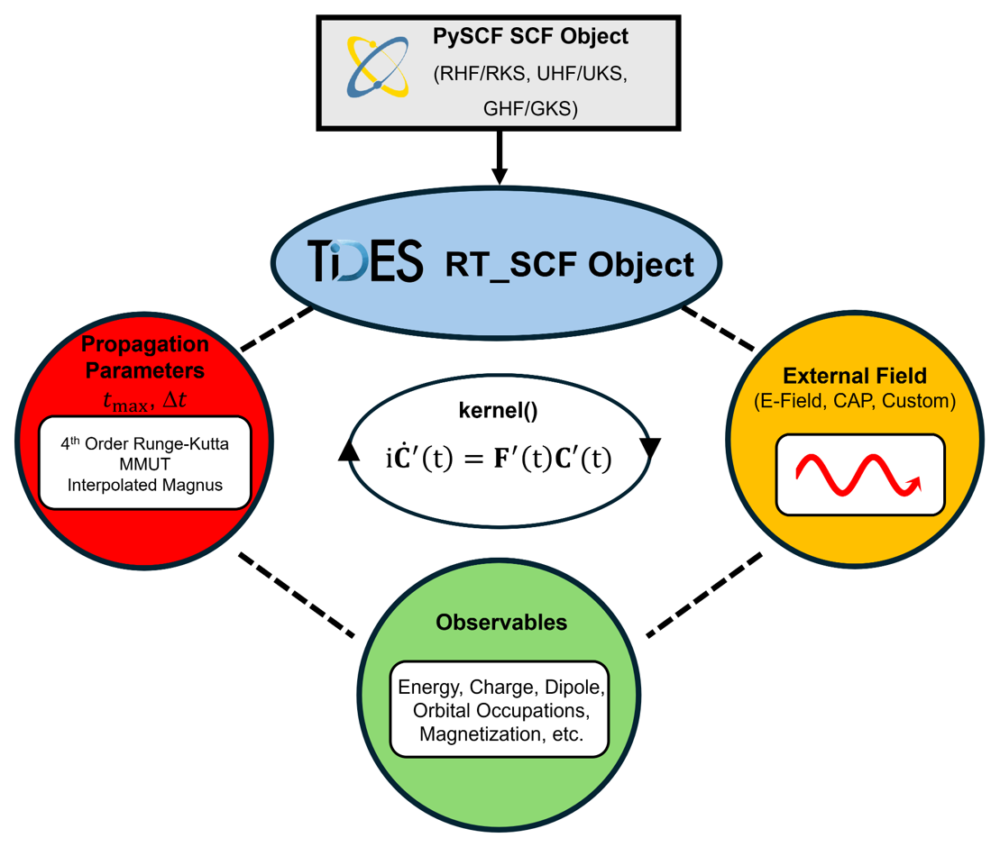

# TiDES

**Ti**me-**D**ependent **E**lectronic **S**tructure — an open-source package for
real-time electronic structure simulations, built on top of
[PySCF](https://pyscf.org).

TiDES propagates the electronic density matrix in real time, giving direct access
to observables that are awkward or impossible to obtain from linear-response
methods: charge migration, non-perturbative field response, ionization via
complex absorbing potentials, and coupled electron–nuclear dynamics via
Ehrenfest.

The design philosophy is modularity. A converged PySCF SCF object goes in;
propagation parameters, observables, and external potentials are attached as
plain attributes; `kernel()` runs the dynamics. Adding a new observable or a new
external potential requires no changes to the TiDES source — you write a
function or a class in your own input file.

{ width="620" }
/// caption
The general design of the `RT_SCF` base class. A PySCF SCF object (grey) is
passed in on instantiation. Propagation parameters (red), observables (green),
and external potentials (orange) are attributes of the resulting object.
`kernel()` begins time propagation. Figure from Rohan *et al.* (2026),
[CC BY-NC 4.0](https://creativecommons.org/licenses/by-nc/4.0/).
///

## Capabilities

| Area | Notes |
|---|---|
| RT-TDHF / RT-TDDFT | Spin-restricted, unrestricted, and generalized references (RHF/UHF/GHF, RKS/UKS/GKS) |
| [Integrators](user-guide/integrators.md) | Six schemes for `RT_SCF`, from cheap explicit leapfrog to self-consistent 4th-order Magnus |
| [Ehrenfest dynamics](user-guide/ehrenfest.md) | `RT_Ehrenfest` — *ab initio* coupled electron–nuclear propagation with mixed timestepping |
| [Relativistic](user-guide/relativistic.md) | X2C1e and 4-component DHF/DKS via PySCF; ZORA for generalized references |
| [Spin dynamics](user-guide/observables.md#magnetization) | Non-collinear magnetization, spin precession, spin–orbit coupling inherited from PySCF |
| [External potentials](user-guide/potentials.md) | Electric fields (delta, gaussian, hann, resonant), static magnetic fields, complex absorbing potentials |
| [Spectroscopy](user-guide/spectroscopy.md) | UV-Vis and XAS from the dipole response to a delta kick |
| [Observables](user-guide/observables.md) | 22 built-in, including Mulliken/Hirshfeld charges, magnetization, MO occupations, cube densities |
| [CAS/RAS](user-guide/cas-ras.md) | TD-CASCI and TD-CASSCF via `RT_CAS_RAS` |
| [GPU](user-guide/gpu.md) | Optional gpu4pyscf-backed Fock builds |
| [Customization](customization/observables.md) | Custom observables and potentials without touching the source |

## The basic workflow

1. Build a PySCF `mol`
2. Create and run an SCF object (RHF/UHF/GHF/RKS/UKS/GKS)
3. Wrap it in `RT_SCF` or `RT_Ehrenfest` with propagation parameters
4. Declare observables — nothing is computed unless you ask for it
5. Add any external potentials
6. Call `.kernel()`

```python
from pyscf import gto, dft
from tides import RT_SCF, ElectricField

mol = gto.M(atom='H 0 0 0; H 0 0 0.75', basis='6-31G')

rks = dft.RKS(mol)
rks.xc = 'B3LYP'
rks.kernel()

rt = RT_SCF(rks, timestep=0.2, max_time=500)
rt.observables.update(energy=True, dipole=True)
rt.add_potential(ElectricField('delta', [0.0001, 0.0, 0.0]))
rt.kernel()
```

See [Installation](getting-started/installation.md) to get set up, or
[First Calculation](getting-started/first-calculation.md) for a worked example
with analysis.

## Examples

The [Examples](examples.md) page indexes every runnable script in the
repository, including the inputs that generated each figure in the TiDES paper.
`examples/Example_Workbook.ipynb` is a good interactive starting point.

## Citing

If you use TiDES, please cite the paper — see [Cite](cite.md).
