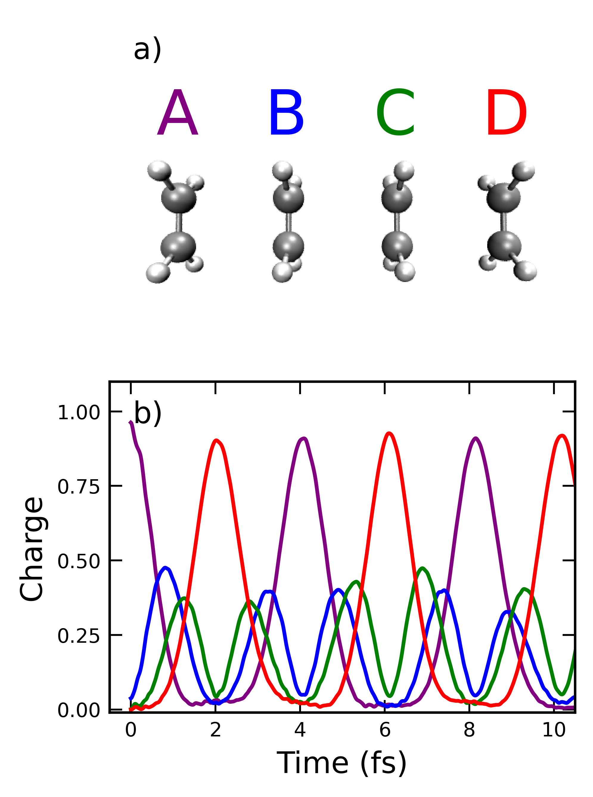
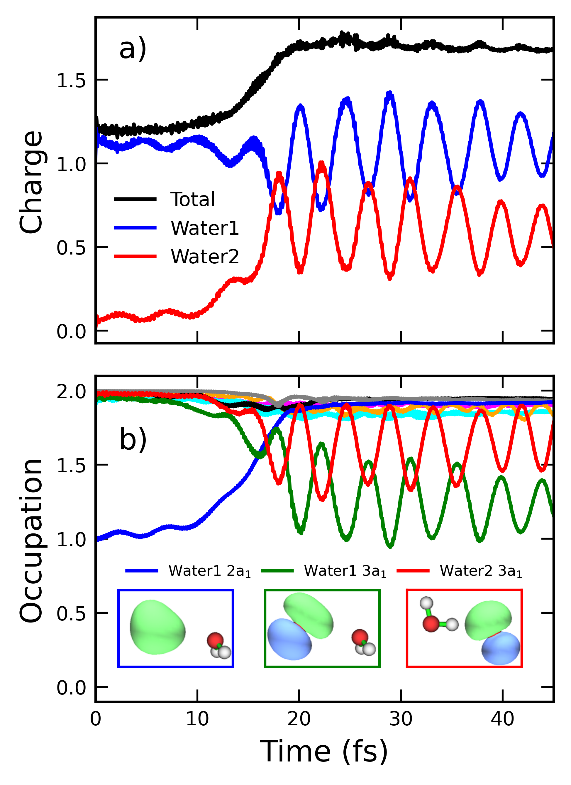

# Fragments & NOSCF

Real-time dynamics is at its most useful when the initial state is *not* the
ground state. A common and powerful way to build such a state is to combine the
ground-state orbitals of isolated fragments into a single coefficient matrix for
the supersystem.

These orbitals do not represent the ground state of the full system — they are
nearly perfectly localized on each fragment, which is exactly the point. It lets
you start with a charge or a hole localized where you want it, and watch it move.

## The NOSCF routine

For a system of monomers 1 and 2 with orthogonalized MO coefficients
$\mathbf{C}'_1$ and $\mathbf{C}'_2$, the combined orbitals are block-assembled
from the fragment coefficients. The resulting matrix is **not** orthogonal, so
TiDES orthogonalizes it via QR factorization and returns the orthogonal
$\mathbf{Q}$ as the NOSCF basis.

The routine originates in NWChem.

```python
from pyscf import gto, scf
from tides import RT_SCF
from tides.utils import basis_utils

dimer, Li1, Li2 = gto.Mole(), gto.Mole(), gto.Mole()
# ... define geometries, charges, spins, then build ...

dimer, Li1, Li2 = scf.UHF(dimer), scf.UHF(Li1), scf.UHF(Li2)
dimer.kernel(); Li1.kernel(); Li2.kernel()

# Overwrite the dimer's MOs with the combined fragment orbitals
dimer.mo_coeff = basis_utils.noscfbasis(dimer, Li1, Li2)

rt = RT_SCF(dimer, 0.05, 500)
rt.observables.update(mulliken_atom_charge=True, hirsh_atom_charge=True)
rt.kernel()
```

```python
noscfbasis(scf, *fragments, reorder=True, orth=None)
```

The dimer SCF still needs building, but converging it is not strictly necessary
since its MO coefficients are overwritten.

!!! note "This changes the initial state, not the dynamics"
    Projecting the density matrix onto a fragment basis for population analysis
    does not affect the propagation in any way. But *initializing* in this basis
    does — you are deliberately preparing a high-energy, non-stationary state.

## Population analysis on fragments

The same fragment orbitals make a far more informative basis for MO occupations
than the supersystem's ground-state orbitals. Instead of "MO 7 lost 0.6
electrons," you get "the inner-valence 2a₁ of Water 1 lost 0.6 electrons."

`tides.utils.rt_utils.input_fragments` registers fragments on the RT object so
that energies and charges are reported per fragment:

```python
from tides.utils.rt_utils import input_fragments

input_fragments(rt, Li1, Li2)
```

Fragment quantities then appear in the output and are parsed into
`result['frag_charge']`.

## Worked example: charge migration

{ width="400" }
/// caption
(a) A chain of four eclipsed ethylene molecules spaced 3 Å apart. (b)
Time-dependent Hirshfeld charge on each monomer after ionization out of the HOMO
of molecule A. Figure from Rohan *et al.* (2026),
[CC BY-NC 4.0](https://creativecommons.org/licenses/by-nc/4.0/).
///

Ground-state calculations are performed on each ethylene in isolation, an
electron is removed from the HOMO of molecule A, and the isolated density
matrices are combined through NOSCF. The hole migrates A → B → C → D, reaching
≈ 0.875 on D, then reflects back — an artifact of the finite chain.

The calculation uses the range-separated CAM-B3LYP functional; its exact
exchange at long range mitigates DFT's well-known difficulty with long-range
charge transfer.

Inputs: `examples/ExamplesFromOriginalTiDESPaper/ChargeMigration/`. A simpler
two-fragment case is `examples/Li_ChargeTransfer/`, and
`examples/TCNE_ChargeTransfer/` shows the same with density fitting.

## Worked example: ICD

{ width="400" }
/// caption
(a) Time-dependent charge of the water dimer after inner-valence ionization out
of the Water 1 2a₁ MO: Water 1 (blue), Water 2 (red), total (black). (b) MO
occupations, with insets showing the participating orbitals. Figure from Rohan
*et al.* (2026),
[CC BY-NC 4.0](https://creativecommons.org/licenses/by-nc/4.0/).
///

This is where fragment-basis occupations earn their keep. Panel (b) resolves the
mechanism that panel (a) only hints at: the inner-valence 2a₁ vacancy on Water 1
is filled by its outer-valence 3a₁, while an electron is simultaneously ionized
from the 3a₁ of Water 2 — the signature of intermolecular Coulombic decay. A
[CAP](potentials.md#complex-absorbing-potential) removes the secondary ionized
electron.

Inputs: `examples/ExamplesFromOriginalTiDESPaper/ICD/`.

## Exciting an initial state directly

For simpler non-stationary states you can manipulate occupations instead of
building a fragment basis. `tides.utils.rt_utils` provides:

```python
from tides.utils.rt_utils import excite, single_excite

excite(rt, excitation_alpha=5)                       # move an alpha electron
single_excite(rt, excitation_alpha_from=5, excitation_alpha_to=6)
```

Any modification of the SCF object's MO coefficients or the occupation vector
before `kernel()` produces a non-stationary 1RDM that will evolve.
